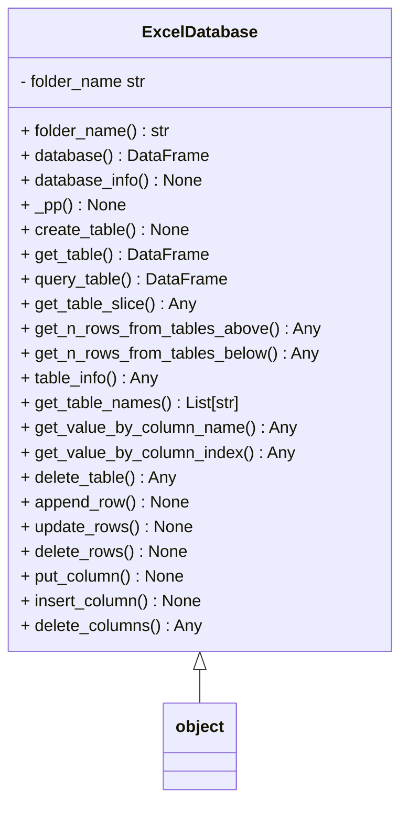

# Design Overview

The excel database can be manipulated from the ``ExcelDatabase`` class specified below 

## Schema
The database is organized in folders and excel files, where folders represent databases and excel files are tables
 
## Improvements
- [ ] create a way to index the different files (if i want to link two values from two different tables) some potential solutions
* use sub_folders within the folder (database) to group related tables (parents of a table)
* include a schema 
- [ ] Implement loc method
using the loc method the rows could be updated more effectively
import pandas as pd
```python
# Update rows 2 through 4 in column 'B' to be 0
df.loc[2:4, 'B'] = 0
# Update rows where the value in column 'A' is greater than 2
df.loc[df['A'] > 2, 'B'] = 0
# Update columns 'B' and 'C' for all rows
df.loc[:, ['B', 'C']] = 0
```
