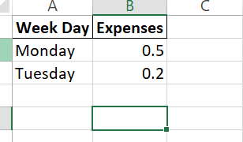
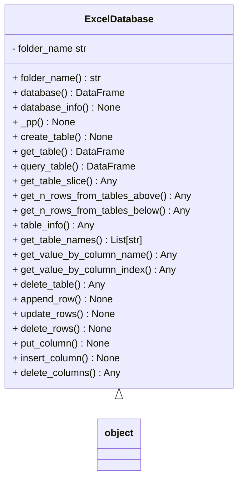
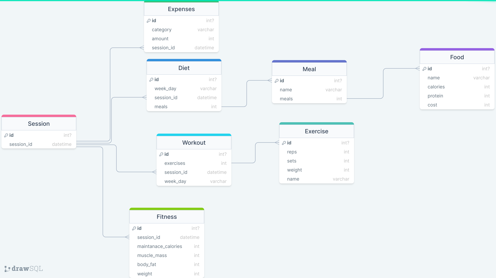
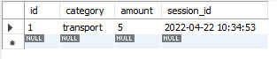

# Protocol Database

The excel database can be manipulated from the ``ExcelDatabase`` 

## Example

```python
from exceldatabase import ExcelDatabase

if __name__ == "__main__":
  db = ExcelDatabase()
  db.create_table("my_routine", ["Week Day", "Expenses"], [
                  ["Monday", 0.5], ["Tuesday",0.2]])
  print(db.get_table("my_routine"))
  db.preview_table("my_routine")
```
>output
```bash
  Week Day  Expenses
0   Monday       0.5
1  Tuesday       0.2
```

To inspect the file if the preview_table method does not run you can run the following command
```bash
start excel protocol_database\my_routine.xlsx
```
>output
<div style="width: 100%; display: flex; justify-content: center; align-items: center;">
  
</div>

## Design Overview

the ``ExcelDatabase`` class is specified below 
Example of creating a table


## Schema
The database is organized in folders and excel files, where folders represent databases and excel files are tables

## Improvements
- [ ] create a way to index the different files (if i want to link two values from two different tables) some potential solutions
* use sub_folders within the folder (database) to group related tables (parents of a table)
* include a schema 
- [ ] Implement loc method
using the loc method the rows could be updated more effectively
import pandas as pd
```python
# Update rows 2 through 4 in column 'B' to be 0
df.loc[2:4, 'B'] = 0
# Update rows where the value in column 'A' is greater than 2
df.loc[df['A'] > 2, 'B'] = 0
# Update columns 'B' and 'C' for all rows
df.loc[:, ['B', 'C']] = 0
```

## SQL Database

In order to build the protocol backend you can use the following diagramming tool,
with the latest version being the [following](https://drawsql.app/teams/university-of-sheffield/diagrams/my-routine).
Alternatively you cna do so from existing objects by using the `.columns` property

### From Existing Class

```python
@dataclass
class DietBase:

    _name: str = "Diet Base"
    _total: Dict[str, Any] = field(default_factory=lambda: {"protein": 0, "calories": 0,
                                                            "cost": 0.0, "amount": 0.0})
    @property
    def data(self) -> Dict[str, Any]:
        return {**self._total, **{k.replace("_", ""): self.__dict__[k] for k in self.__dict__.keys()}}

    @property
    def columns(self) -> Tuple[str, ...]:
        return {k: type(self.data[k]) for k in self.data.keys()}
```

### From Diagramming Tool

At the latest, using the diagramming tool mentioned earlier the database schema looks like the following

<div style="width:100%; display:flex; justify-content:center; align-items;center;">

</div>

The code that is exported can then be modified in virtual studio code as follows:

- include all the primary key statement of id at the bottom of the table
- remove all the backticks
- remove all the unsigned stuff
- make the ids not null for the sql server and then remove the not null for the python script

The current script looks like the following:

```sql
CREATE TABLE Session(
    id INT NOT NULL AUTO_INCREMENT,
    session_id DATETIME NOT NULL,
    PRIMARY KEY (id)
);
CREATE TABLE Food(
    id INT NOT NULL AUTO_INCREMENT,
    name VARCHAR(255) NOT NULL,
    calories INT NOT NULL,
    protein INT NOT NULL,
    cost INT NOT NULL,
    PRIMARY KEY (id)
);

CREATE TABLE Meal(
    id INT NOT NULL AUTO_INCREMENT,
    name VARCHAR(255) NOT NULL,
    meals INT NOT NULL,
    PRIMARY KEY (id)
);

CREATE TABLE Diet(
    id INT NOT NULL AUTO_INCREMENT,
    week_day VARCHAR(255) NOT NULL,
    session_id DATETIME NOT NULL,
    meals INT NOT NULL,
    PRIMARY KEY (id)
);

CREATE TABLE Exercise(
    id INT NOT NULL AUTO_INCREMENT,
    reps INT NOT NULL,
    sets INT NOT NULL,
    weight INT NOT NULL,
    name VARCHAR(255) NOT NULL,
    PRIMARY KEY (id)
);

CREATE TABLE Workout(
    id INT NOT NULL AUTO_INCREMENT,
    exercises INT NOT NULL,
    session_id DATETIME NOT NULL,
    week_day VARCHAR(255) NOT NULL,
    PRIMARY KEY (id)
);

CREATE TABLE Fitness(
    id INT NOT NULL AUTO_INCREMENT,
    session_id DATETIME NOT NULL,
    maintanace_calories INT NOT NULL,
    muscle_mass INT NOT NULL,
    body_fat INT NOT NULL,
    weight INT NOT NULL,
    PRIMARY KEY (id)
);

CREATE TABLE Expenses(
    id INT NOT NULL AUTO_INCREMENT,
    category VARCHAR(255) NOT NULL,
    amount INT NOT NULL,
    session_id DATETIME NOT NULL,
    PRIMARY KEY (id)
);

ALTER TABLE
    Diet ADD CONSTRAINT diet_meals_foreign FOREIGN KEY(meals) REFERENCES Meal(id);
ALTER TABLE
    Workout ADD CONSTRAINT workout_exercises_foreign FOREIGN KEY(exercises) REFERENCES Exercise(id);
ALTER TABLE
    Meal ADD CONSTRAINT meal_meals_foreign FOREIGN KEY(meals) REFERENCES Food(id);
```

To test the created database you can insert some test data as follows

```sql
INSERT INTO Session (session_id) VALUES ('2022-04-22 10:34:53.44');
INSERT INTO Expenses (category, amount, session_id) VALUES
("transport",5, '2022-04-22 10:34:53.44');
```

finally you can get one of the columns of one of the tables to see what it looks like

```sql
SELECT * FROM Expenses;
```

and this is what the data looks like

<div style="width:100%; display:flex; justify-content:center; align-items;center;">

</div>

The final python code to run on sqlite is:

```python
SQL_STATEMENTS = ['''
CREATE TABLE Session(
    id INTEGER PRIMARY KEY AUTOINCREMENT,
    session_id DATETIME NOT NULL
);''', '''
CREATE TABLE Food(
    id INTEGER PRIMARY KEY AUTOINCREMENT,
    name VARCHAR(255) NOT NULL,
    calories FLOAT NOT NULL,
    protein FLOAT NOT NULL,
    cost FLOAT NOT NULL
);''', '''

CREATE TABLE Meal(
    id INTEGER PRIMARY KEY AUTOINCREMENT,
    name VARCHAR(255) NOT NULL,
    recipe INT NOT NULL,
    FOREIGN KEY(recipe) REFERENCES Food(id)
);''', '''

CREATE TABLE Diet(
    id INTEGER PRIMARY KEY AUTOINCREMENT,
    week_day VARCHAR(255) NOT NULL,
    session_id DATETIME NOT NULL,
    meals INT NOT NULL,
    FOREIGN KEY(meals) REFERENCES Meal(id)
);''', '''

CREATE TABLE Exercise(
    id INTEGER PRIMARY KEY AUTOINCREMENT,
    reps INT NOT NULL,
    sets INT NOT NULL,
    weight FLOAT NOT NULL,
    name VARCHAR(255) NOT NULL
);''', '''

CREATE TABLE Workout(
    id INTEGER PRIMARY KEY AUTOINCREMENT,
    exercises INT NOT NULL,
    session_id DATETIME NOT NULL,
    week_day VARCHAR(255) NOT NULL,
    FOREIGN KEY(exercises) REFERENCES Exercise(id)
);''', '''

CREATE TABLE Fitness(
    id INTEGER PRIMARY KEY AUTOINCREMENT,
    session_id DATETIME NOT NULL,
    maintanace_calories FLOAT NOT NULL,
    muscle_mass FLOAT NOT NULL,
    body_fat FLOAT NOT NULL,
    weight FLOAT NOT NULL
);''', '''

CREATE TABLE Expenses(
    id INTEGER PRIMARY KEY AUTOINCREMENT,
    category VARCHAR(255) NOT NULL,
    amount FLOAT NOT NULL,
    session_id DATETIME NOT NULL
);''']
```

to convert the statements into sqlite3 friendly statements you can run

- replace the `id INT NOT NULL AUTO_INCREMENT` in sql with the `id INTEGER PRIMARY KEY AUTOINCREMENT`
- remove the alter statements at the bottom `ALTER TABLE Meal ADD CONSTRAINT meal_meals_foreign FOREIGN KEY(meals) REFERENCES Food(id);` with constraints to add this ` FOREIGN KEY(exercises) REFERENCES Exercise(id)`
  to the correct table
- use `cntrl + F2` on `);` to add `''','''` and wrap the entire code with `[''' ''']`

# Text database

the text database is the most simple database, this will save all the data, integers, floats, strings etc... into a text file
the text file can then be accessed as a list later on.
Data should be passed one by one to the write function and can be retrieved as in a list as shown in the example below

### Example

```python
from text_db import read_db, write_to_db, refresh_db

if __name__ == "__main__":
    write_to_db(0)
    write_to_db(1)
    write_to_db(2)
    write_to_db(3)
    print(read_db())
    refresh_db()

```

### Output
```txt
Max Database Size (bytes) 1000000
Current db size
3 bytes
Current db size
6 bytes
Current db size
9 bytes
Current db size
12 bytes
[0.0, 1.0, 2.0, 3.0]
```